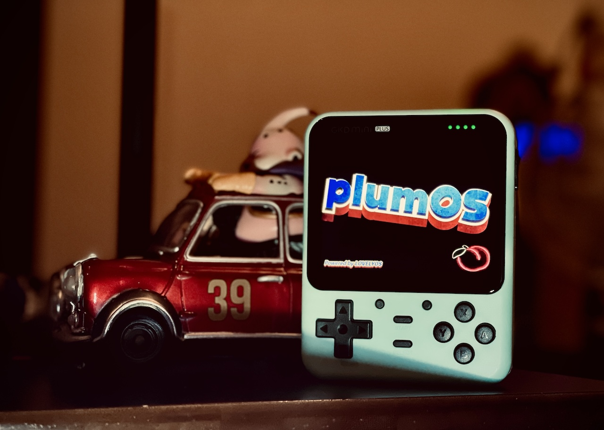

  
  
   
   
   
   
  

[Latest Version 0.2](https://github.com/game-de-it/plumOS-GKD/releases/tag/plumOS_GKDbubble_v0.2) 

---
# はじめに
[Click here for the English version of the explanation](./README_EN.md)

plumOS-GKDはBubbleのStockOS(BBGV5.3 2024-10-15)をベースにカスタムされたOSです  
mini PLUSのSDイメージにはBubbleのstockOSの内容が一部適用されています  

## 対応機種
- GKD Bubble
- GKD mini PLUS
- [動作未確認]GKD Mini PLUS Classic(アナログスティック付きのメタル筐体)

- 
## ダウンロード
[「Releasesページ」からSDイメージファイルをダウンロードできます](https://github.com/game-de-it/plumOS-GKD/releases)

## 更新履歴
- [NEW] StockOS BBGV5.3 2024-10-15 がベースになりました
  - [詳しい更新内容はこちらを参照してください](https://github.com/game-de-it/plumOS-GKD/blob/main/about.txt)
- [NEW] イコライザー機能が利用可能になりました
  - イコライザー機能を恒久的に無効化したい場合は、Emulationstationのtoolsセクションにある`Equalizer`を実行してください  
(再度実行するとイコライザー機能が有効になります)
- [NEW] USB-DACおよびBluetooth-AUDIOアダプタが利用可能になりました
  - ゲームを終了した状態でUSB機器を接続してください
  - 動作確認済みBluetooth AUDIOドングル
    - Creative BT-W2
    - GuliKit Route Air
- [NEW] Retroarchのフィルター、オーバレイが追加されました
  - [perfect_overlays](https://github.com/ourigen/perfect_overlays)
  - [muOS_Customization](https://github.com/mugwomp93/muOS_Customization)
  - [Retro-Overlays](https://github.com/Jeltr0n/Retro-Overlays)

## 基本的な機能
- [pyxel v2.2.1](https://github.com/kitao/pyxel) が利用可能
- フロントエンドにEmulationstationとgmenu2xが利用可能
  - ES->Gmenu2xへ切り替える場合は、SELECTボタンを押して"GO LOVELYCHILD"を実行します
  - Gmenu2x->ESへ切り替える場合は、Settingセクションにある"ES"アイコンを実行します
- HDMI出力が利用可能(Bubble)
  - 電源を切った状態でHDMIケーブルを抜き差ししてください
- SD1側はEXT4でフォーマットされているため、wifiからsftpで接続してファイル転送をするか、SD2をfat32(exFAT)でフォーマットして利用してください
- SSH接続およびsftp接続のアカウント
  - ユーザ名は `root` 、パスワードは `plumos`

## 既知の問題
- WifiをONにするとポップノイズが発生することがあるため、必要な時以外はOFFにすることをお勧めします
- スクレイピング機能は利用できません

## CPUとGPUのパフォーマンスについて
- デフォルトではCPU周波数は負荷に応じて自動的に400MHz~1992MHzの間で増減しますが、ゲームによってはMAXパフォーマンスを明示的に設定すると安定する可能性があります
  - エミュレーターごとにMAXパフォーマンスを設定したい場合
    - ROM選択画面でSELECTボタンを押して`ADVANCED SYSTEM OPTIONS`の`CPU SCALING GOVERNOR`を`PERFORMANCE`に設定して、`GPU PERFORMANCE PROFILE`を`BEST PERFORMANCE`に設定します
  - ROMごとにMAXパフォーマンスを設定したい場合
    - 任意のROMにカーソルを合わせてXボタンを押して`ADVANCED GAME OPTIONS`の`CPU SCALING GOVERNOR`を`PERFORMANCE`に設定して、`GPU PERFORMANCE PROFILE`を`BEST PERFORMANCE`に設定します
  - 全てのエミュレータにMAXパフォーマンスを設定したい場合
    - スタートボタンを押して`SYSTEM SETTINGS`の`DEFAULT SCALING GOVERNOR`を`PERFORMANCE`に設定して、`GPU PERFORMANCE PROFILE`を`BEST PERFORMANCE`に設定します

## 各ボタンの説明
  

## Retroarchの仕様
- セーブファイルおよびステートセーブはromファイルと同じフォルダに作成されます(変更可能)
- ステートセーブファイルはromファイルと同じフォルダに作成されます(変更可能)
- RetroArchのホットキー
  - ※Hotkeyの設定は自由に変更可能です  

| Button Combo | Action | 
|:-----------|------------:|
| F1     |      Retroarchメニュー表示 |
| SELECT+R       |        ステートセーブ |
| SELECT+L     |      ステートロード |
| SELECT+R2     |      ファストフォワード(早送りx2倍) |
| SELECT+L2     |      スローモーション(x1.5倍) |
| SELECT+X     |      スナップショット(roms/screenshots) |
| SELECT+Y     |      FPS表示 |

## OSのホットキー
| Button Combo | Action | 
|:-----------|------------:|
| F2+Vol+       |        画面輝度を上げる |
| F2+Vol-       |        画面輝度を下げる |

## retrorunの仕様
- retrorunのホットキー
  

## 各エミュレータのデータ保存場所
セーブデータのバックアップなどをする際に参考にしてください
| Emulator | DIR | 
|:-----------|------------:|
| drastic       |        /storage/.config/drastic |
| ppsspp       |         /storage/.config/ppsspp |
| retroarch    |       各romディレクトリ内 |
| その他のEmu      |       /storage/roms/savestates |

---

