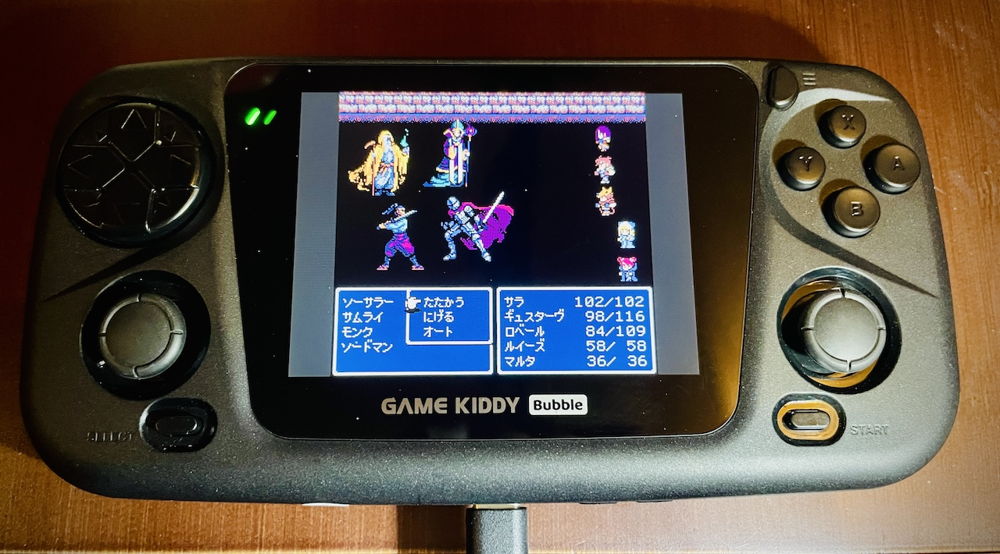
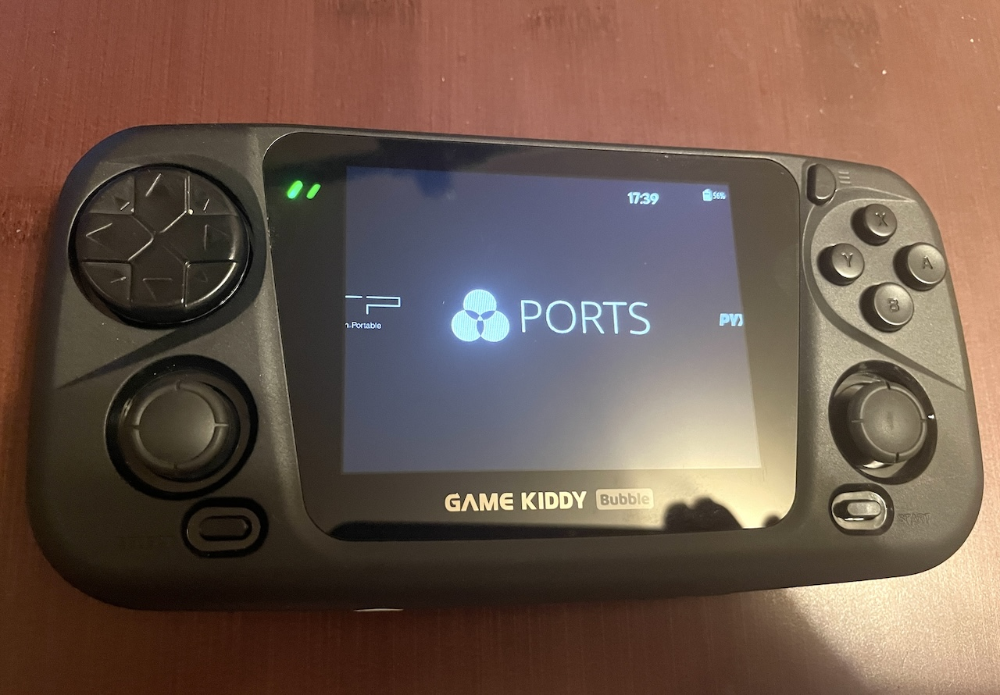
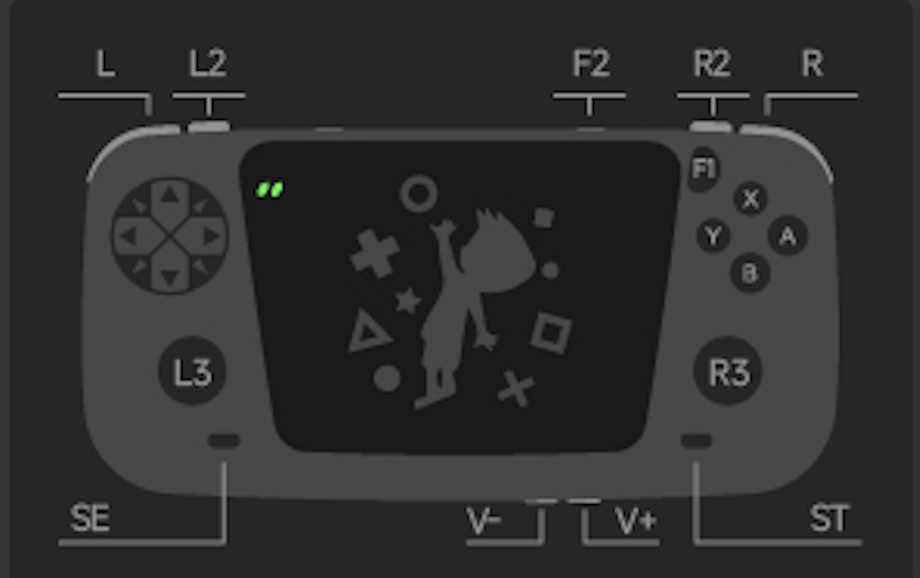

  
  
   
   
   
   

[Latest Version 0.1](https://github.com/game-de-it/plumOS-GKD/releases) 

---
# はじめに
[Click here for the English version of the explanation](./README_EN.md)

plumOS-GKDはStockOSをベースにカスタムされたOSです

## ダウンロード
[「Releasesページ」からファイルをダウンロードできます](https://github.com/game-de-it/plumOS-GKD/releases)

## 更新履歴
[NEW] 0.1 をリリースしました！

## 基本的な機能
- [pyxel v2.2.1](https://github.com/kitao/pyxel) が利用可能
- フロントエンドにEmulationstationとgmenu2xが利用可能
  - ES->Gmenu2xへ切り替える場合は、SELECTボタンを押して"GO LOVELYCHILD"を実行します
  - Gmenu2x->ESへ切り替える場合は、Settingセクションにある"ES"アイコンを実行します
- フロントエンドは可能な限り英語に翻訳済み
- Portmasterが利用可能
- HDMI出力が利用可能
  - 電源を切った状態でHDMIケーブルを抜き差ししてください
- SD1側はEXT4でフォーマットされているため、wifiからsftpで接続してファイル転送をするか、SD2をfat32(exFAT)でフォーマットして利用してください
- SSH接続およびsftp接続のアカウント
  - ユーザ名は `root` 、パスワードは `plumos`

## 既知の問題
- USB-DACおよびBluetooth-AUDIOアダプタは利用可能ですが、切り替える仕組みが整っていません
- WifiをONにするとポップノイズが発生することがあるため、必要な時以外はOFFにすることをお勧めします
- ライブラリの問題により64bit版のretroarchと32bit版のretroarchはバージョンが揃っていません

## 各ボタンの説明
  

## Retroarchの仕様
- セーブファイルおよびステートセーブはromファイルと同じフォルダに作成されます(変更可能)
- ステートセーブファイルはromファイルと同じフォルダに作成されます(変更可能)
- RetroArchのホットキー
  - ※Hotkeyの設定は自由に変更可能です  

| Button Combo | Action | 
|:-----------|------------:|
| F1     |      Retroarchメニュー表示 |
| SELECT+R       |        ステートセーブ |
| SELECT+L     |      ステートロード |
| SELECT+R2     |      ファストフォワード(早送りx2倍) |
| SELECT+L2     |      スローモーション(x1.5倍) |
| SELECT+X     |      スナップショット(roms/screenshots) |
| SELECT+Y     |      FPS表示 |

## OSのホットキー
| Button Combo | Action | 
|:-----------|------------:|
| F2+Vol+       |        画面輝度を上げる |
| F2+Vol-       |        画面輝度を下げる |

---

