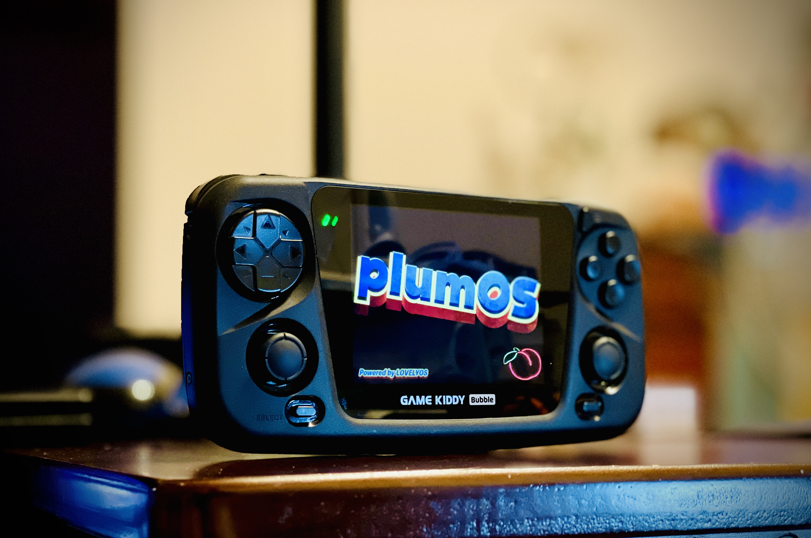
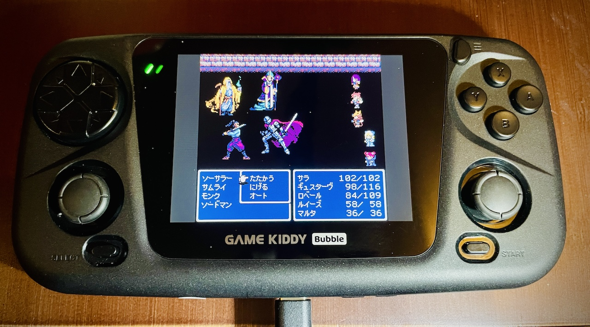
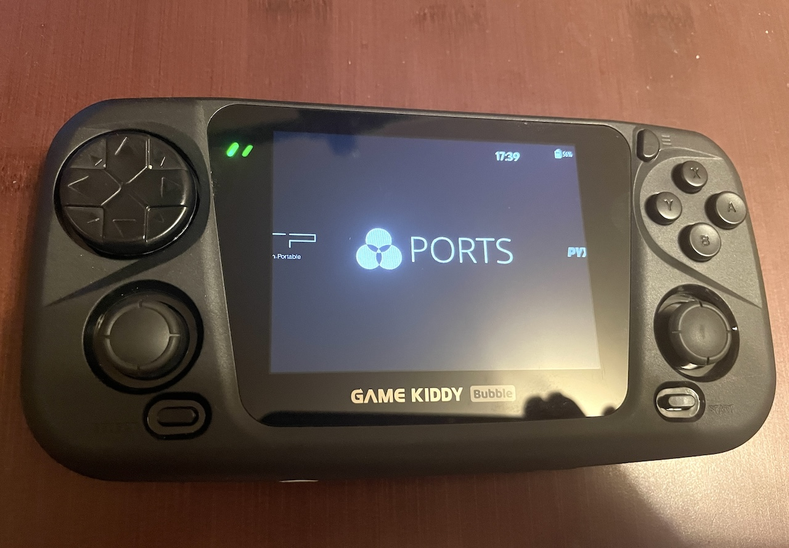
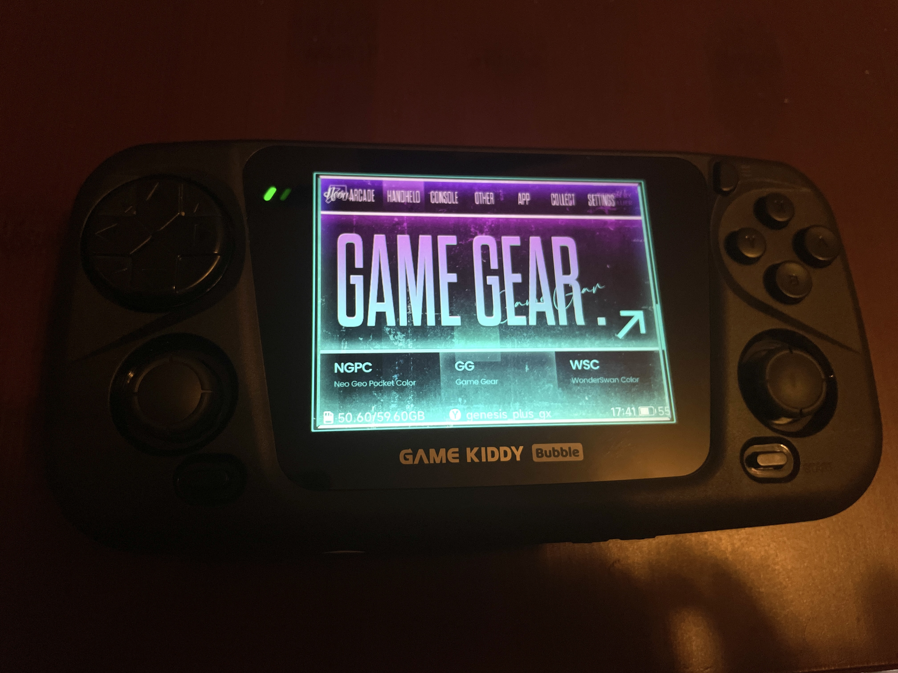
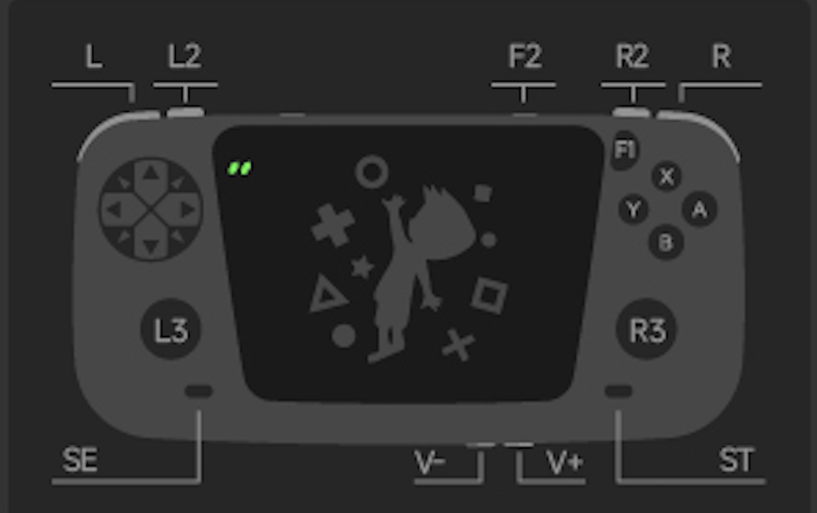
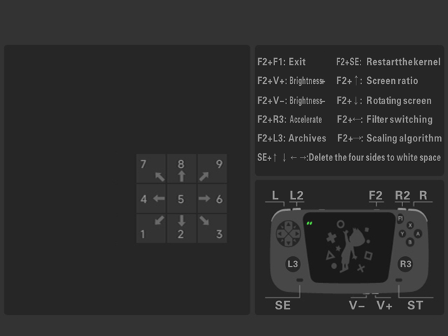

  
  
   
   
   
   

[Latest Version 0.2](https://github.com/game-de-it/plumOS-GKD/releases/tag/plumOS_GKDbubble_v0.2) 

---
# Introduction
plumOS-GKD is a custom OS based on StockOS (BBGV5.3 2024-10-15).

## Download
[You can download the SD image file from the "Releases page"](https://github.com/game-de-it/plumOS-GKD/releases)

## Changelog
- [NEW] Based on StockOS BBGV5.3 2024-10-15
  - [Refer here for detailed update information](https://github.com/game-de-it/plumOS-GKD/blob/main/about.txt)
- [NEW] Equalizer feature is now available
  - If you want to permanently disable the equalizer feature, run `Equalizer` in the tools section of Emulationstation  
(Re-run to enable the equalizer feature again)
- [NEW] USB-DAC and Bluetooth-AUDIO adapters are now available
  - Connect USB devices while games are not running
  - Verified compatible Bluetooth AUDIO dongles:
    - Creative BT-W2
    - GuliKit Route Air
- [NEW] Retroarch filters and overlays have been added
  - [perfect_overlays](https://github.com/ourigen/perfect_overlays)
  - [muOS_Customization](https://github.com/mugwomp93/muOS_Customization)
  - [Retro-Overlays](https://github.com/Jeltr0n/Retro-Overlays)

## Basic Features
- [pyxel v2.2.1](https://github.com/kitao/pyxel) is available
- Emulationstation and gmenu2x can be used as frontends
  - To switch from ES to Gmenu2x, press the SELECT button and run "GO LOVELYCHILD"
  - To switch from Gmenu2x to ES, run the "ES" icon in the Setting section
- HDMI output is available
  - Plug or unplug the HDMI cable while the power is off
- The SD1 side is formatted with EXT4, so use sftp over wifi for file transfer or format SD2 with fat32 (exFAT)
- SSH and sftp connection accounts:
  - Username: `root`, Password: `plumos`

## Known Issues
- Pop noise may occur when Wifi is ON, so it is recommended to keep it OFF unless necessary
- Scraping feature is not available

## About CPU and GPU Performance
- By default, the CPU frequency automatically adjusts between 400MHz and 1992MHz depending on the load, but for certain games, explicitly setting MAX performance may stabilize them.
  - To set MAX performance for each emulator:
    - In the ROM selection screen, press SELECT and set `CPU SCALING GOVERNOR` to `PERFORMANCE` and `GPU PERFORMANCE PROFILE` to `BEST PERFORMANCE` in `ADVANCED SYSTEM OPTIONS`.
  - To set MAX performance for each ROM:
    - Highlight a ROM and press the X button, then set `CPU SCALING GOVERNOR` to `PERFORMANCE` and `GPU PERFORMANCE PROFILE` to `BEST PERFORMANCE` in `ADVANCED GAME OPTIONS`.
  - To set MAX performance for all emulators:
    - Press the Start button and set `DEFAULT SCALING GOVERNOR` to `PERFORMANCE` and `GPU PERFORMANCE PROFILE` to `BEST PERFORMANCE` in `SYSTEM SETTINGS`.

## Button Descriptions
  

## Retroarch Specifications
- Save files and state saves are created in the same folder as the ROM files (can be changed)
- State save files are created in the same folder as the ROM files (can be changed)
- RetroArch Hotkeys:
  - ※Hotkey settings can be freely changed  

| Button Combo | Action | 
|:-----------|------------:|
| F1     |      Display Retroarch menu |
| SELECT+R       |        Save State |
| SELECT+L     |      Load State |
| SELECT+R2     |      Fast Forward (x2 speed) |
| SELECT+L2     |      Slow Motion (x1.5 speed) |
| SELECT+X     |      Screenshot (roms/screenshots) |
| SELECT+Y     |      Display FPS |

## OS Hotkeys
| Button Combo | Action | 
|:-----------|------------:|
| F2+Vol+       |        Increase screen brightness |
| F2+Vol-       |        Decrease screen brightness |

## retrorun Specifications
- retrorun Hotkeys:
  

## Save Data Location for Each Emulator
Use this as a reference when backing up save data.
| Emulator | DIR | 
|:-----------|------------:|
| drastic       |        /storage/.config/drastic |
| ppsspp       |         /storage/.config/ppsspp |
| retroarch    |       In each ROM directory |
| Other Emulators      |       /storage/roms/savestates |

---
